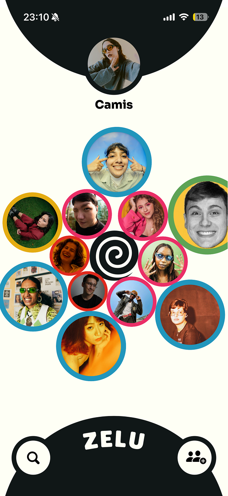
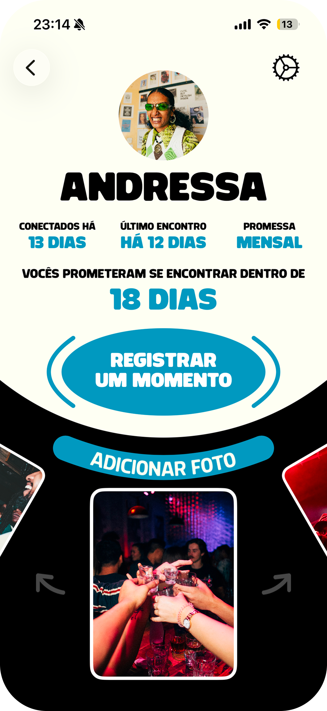
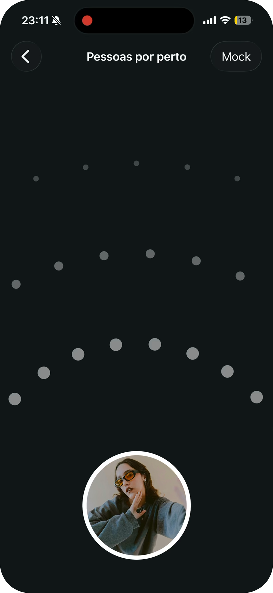
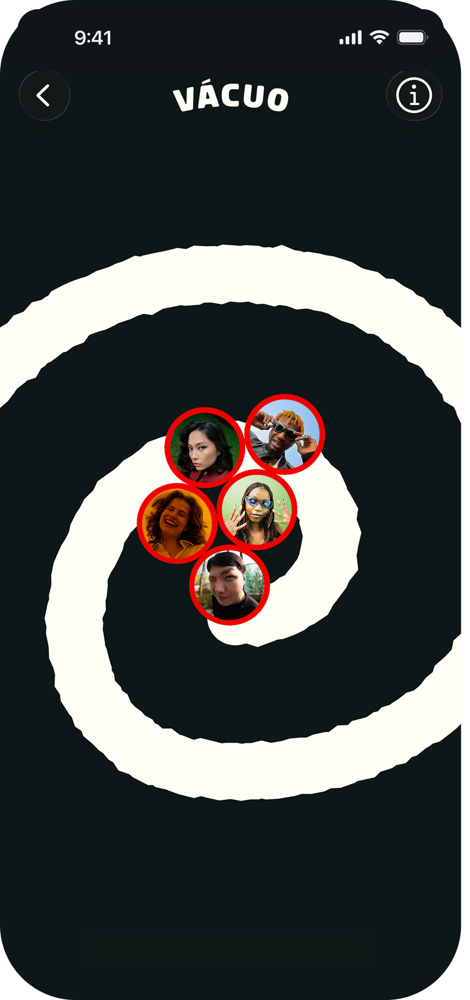

<div align="center">


# Zelu

### Keep your friendships alive — before they drift into the void. 🫧

Zelu turns your relationships into living bubbles you can touch and play with. The more
you actually see a friend, the bigger their bubble; neglect them and they shrink and
drift toward the void at the center. Set a goal for how often you want to meet, see each
other in real life, and keep them close — all in a native SwiftUI + SpriteKit app.

<br/>

[](https://apps.apple.com/br/app/zelu/id6772319658)
[](https://testflight.apple.com/join/MuUJhqc9)
[](https://zelu.online)
[](https://www.apple.com/ios/)
[](https://swift.org)
[](https://developer.apple.com/xcode/swiftui/)
[](LICENSE)

</div>

---

## 📑 Table of Contents

- [About](#-about)
- [Screenshots](#-screenshots)
- [Features](#-features)
- [How It Works](#-how-it-works)
- [Tech Stack](#-tech-stack)
- [Project Structure](#-project-structure)
- [Getting Started](#-getting-started)
- [Roadmap](#-roadmap)
- [Authors](#-authors)
- [License](#-license)

---

## 📖 About

Zelu is a *relationship-cultivating* app — *"seu mais novo ambiente cultivador de
relacionamentos."* Instead of a flat contact list, your friendships live as **bubbles**
in an interactive physics scene. You can drag them around and play with their photos,
and the **size** of each bubble shows how much you've actually been seeing that friend.

At the center sits the **void** (`vácuo`). When a friendship goes too long without a
real-world encounter, that friend's bubble shrinks and drifts into the void. Meet up in
time and you pull them back out — but leave them too long and you lose the contact for
good, having to reconnect in person from scratch. You keep friends close by setting a
**meeting goal** (`Meta`) and meeting them in person.

Adding friends happens in person: when you and a friend are near each other with the app
open, your phones recognize each other over Bluetooth and the local network — no links,
no QR codes, and no account, phone number, or email required.

Zelu is **live on the App Store** — [download it here](https://apps.apple.com/br/app/zelu/id6772319658)
or [join the TestFlight beta](https://testflight.apple.com/join/MuUJhqc9).
Learn more at [**zelu.online**](https://zelu.online) (landing page repo:
[C13G1/zelu-landing](https://github.com/C13G1/zelu-landing)).

---

## 📸 Screenshots

<div align="center">






</div>

---

## 🚀 Features

- **🫧 Friend bubbles** — interactive bubbles you can drag and play with in a SpriteKit physics scene; each bubble grows or shrinks with how much you actually see that friend.
- **🌀 The void** — neglect a friend and their bubble drifts into the void at the center; meet up in time to rescue them, or leave them too long and lose the contact entirely, having to reconnect in person.
- **🎯 Meeting goals (Metas)** — pick a cadence per friend (weekly, every 15 days, monthly, every 3 / 6 months, yearly); Zelu tracks it and nudges you when it's time to show up.
- **📡 Add in person** — no links or QR codes; bring two phones close and Zelu detects the encounter over Bluetooth (CoreBluetooth) and the local network (MultipeerConnectivity).
- **📸 Moments** — turn each in-person encounter into a photo, kept locally on your device, building a timeline of the friendship.
- **🔓 No account** — just a name and a photo; no signup, phone number, or email.
- **👥 Groups** — organize friends into groups; one free group, with extra slots available via in-app purchase.
- **☁️ iCloud sync** — profiles, connections, and groups sync across devices with CloudKit-backed SwiftData.

---

## ⚙️ How It Works

1. **Create your profile** — just a name and a photo, no signup.
2. **Add friends in person** — bring your phones close and confirm the encounter; they connect over Bluetooth / local network.
3. **Set a Meta** for each friend — choose how often you want to see them.
4. **Meet in real life** — in-person encounters grow the friend's bubble; time apart shrinks it.
5. **Rescue from the void** — neglected friends drift to the void; meet up to pull them back, or lose the contact and have to reconnect in person.

Under the hood, `MetaManager` owns the scoring and recomputes each connection's
`RelationshipState`, which `FriendsScene` reads to size and position every `FriendNode`
bubble — pulling neglected ones toward the central void. Persistence and sync run through
a single CloudKit-backed SwiftData `ModelContainer`.

---

## 🛠️ Tech Stack

| Area | Tech |
|------|------|
| UI | SwiftUI |
| Physics / visualization | SpriteKit |
| Persistence & sync | SwiftData + CloudKit |
| Nearby discovery | CoreBluetooth · MultipeerConnectivity |
| Purchases | StoreKit 2 |
| Notifications | UserNotifications |
| Analytics | Aptabase |
| Architecture | MVVM |

---

## 📂 Project Structure

```
ConexoesAmizaticas/
├── ConexoesAmizaticasApp.swift   # App entry — SwiftData + CloudKit container, analytics
├── Models/                       # Connection, User, Meta, FriendGroup, RelationshipState…
├── ViewModels/                   # MVVM view models (Groups, Profile, BLE, Search…)
├── Views/                        # SwiftUI screens + reusable Components
├── Scenes/                       # FriendsScene — the SpriteKit bubble scene
├── Nodes/                        # FriendNode, SpringNode, CollisionNode
├── Managers/                     # BLE, Nearby, Store, Feed, Meta, CloudKit, notifications
├── Extensions/                   # Swift / SwiftUI helpers
└── Assets.xcassets/              # Colors, icons, themes
```

---

## 🎯 Getting Started

### Requirements

- Xcode 16+
- iOS 18.0+
- An Apple Developer account (CloudKit, Bluetooth, and StoreKit need real capabilities)

### Run

```bash
git clone https://github.com/C13G1/Zelu.git
cd Zelu
open ConexoesAmizaticas.xcodeproj
```

Then set your own **Signing Team** and **Bundle Identifier**, and update the CloudKit
container to one your team owns. Nearby discovery and proximity features are best tested
on **two physical devices** — Bluetooth and Multipeer don't work between simulators.

---

## 🗺️ Roadmap

Things we'd like to bring to Zelu next:

- **Group retrospectives** — shared timelines and memory recaps for whole groups, not just one-on-one friendships.
- More ways to look back on the moments you've built over time.

---

## 👥 Authors

Built at the **Apple Developer Academy | Mackenzie**.

<table width="100%">
  <tr>
    <td align="center" width="16%">
      <a href="https://github.com/camilatoniato"></a>
      <br/><sub><b>Camila Toniato</b></sub><br/>
      <a href="https://github.com/camilatoniato"></a>
      <a href="https://www.linkedin.com/in/camila-ruiz-toniato-91a926301/"></a>
    </td>
    <td align="center" width="16%">
      <a href="https://github.com/dayoleal"></a>
      <br/><sub><b>Dayô Araújo</b></sub><br/>
      <a href="https://github.com/dayoleal"></a>
      <a href="https://www.linkedin.com/in/dayo-araujo/"></a>
    </td>
    <td align="center" width="16%">
      <a href="https://github.com/EnzoFerroni"></a>
      <br/><sub><b>Enzo Ferroni</b></sub><br/>
      <a href="https://github.com/EnzoFerroni"></a>
      <a href="https://www.linkedin.com/in/enzoferroni/"></a>
    </td>
    <td align="center" width="16%">
      <a href="https://github.com/JonasFNMelo"></a>
      <br/><sub><b>Jonas Melo</b></sub><br/>
      <a href="https://github.com/JonasFNMelo"></a>
      <a href="https://www.linkedin.com/in/jonas-melo-/"></a>
    </td>
    <td align="center" width="16%">
      <a href="https://github.com/mathicastanha"></a>
      <br/><sub><b>Mathias Castanha</b></sub><br/>
      <a href="https://github.com/mathicastanha"></a>
      <a href="https://www.linkedin.com/in/mathias-castanha/"></a>
    </td>
    <td align="center" width="16%">
      <a href="https://github.com/ThomasPGR"></a>
      <br/><sub><b>Thomas Pinheiro Grandin</b></sub><br/>
      <a href="https://github.com/ThomasPGR"></a>
      <a href="https://www.linkedin.com/in/thomas-pinheiro-grandin-704bb6297/"></a>
    </td>
  </tr>
</table>

---

## 📄 License

Released under the [MIT License](LICENSE).
