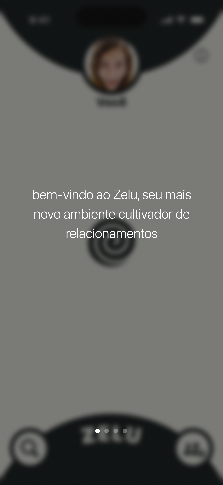

<div align="center">


# Zelu

### Your friendships as a living social universe. 🪐

Zelu turns your relationships into an interactive map: you sit at the center and every
friend orbits you as a planet. The closer the friendship, the closer and brighter the
orbit. Set goals to see each friend, log your encounters, and watch the connection grow
or drift — all in a native SwiftUI + SpriteKit app.

<br/>

[](https://apps.apple.com/br/app/zelu/id6772319658)
[](https://testflight.apple.com/join/MuUJhqc9)
[](https://zelu.online)
[](https://www.apple.com/ios/)
[](https://swift.org)
[](https://developer.apple.com/xcode/swiftui/)
[](LICENSE)

</div>

---

## 📑 Table of Contents

- [About](#-about)
- [Screenshots](#-screenshots)
- [Features](#-features)
- [How It Works](#-how-it-works)
- [Tech Stack](#-tech-stack)
- [Project Structure](#-project-structure)
- [Getting Started](#-getting-started)
- [Authors](#-authors)
- [License](#-license)

---

## 📖 About

Zelu is a *relationship-cultivating* app — *"seu mais novo ambiente cultivador de
relacionamentos."* Instead of a flat contact list, your friendships live in an
interactive physics scene: you are the central spiral, and each friend is a planet
orbiting around you.

Every connection has a **score** and a **relationship state** — `inseparáveis`,
`próximos`, `estáveis`, `distantes`, `afastados`. The state decides how a friend looks
and moves: closer friends orbit faster, larger, and brighter; drifting ones fall to the
outer, slower, dimmer rings. You keep relationships alive by setting **meeting goals**
(`Metas`) and logging real-world encounters, which feeds the score back into the scene.

Zelu also helps you meet people in the first place — it finds other nearby Zelu users
over Bluetooth and the local network, and can nudge you with a notification when someone
is close by.

Zelu is **live on the App Store** — [download it here](https://apps.apple.com/br/app/zelu/id6772319658)
or [join the TestFlight beta](https://testflight.apple.com/join/MuUJhqc9).
Learn more at [**zelu.online**](https://zelu.online) (landing page repo:
[C13G1/zelu-landing](https://github.com/C13G1/zelu-landing)).

---

## 📸 Screenshots

<div align="center">




</div>

---

## 🚀 Features

- **🪐 Social universe** — friends visualized as orbiting planets in an interactive SpriteKit scene, driven by real physics (springs, collisions, orbits).
- **📊 Relationship states** — five closeness tiers that change each friend's orbit radius, speed, size, and color as the connection evolves.
- **🎯 Meeting goals (Metas)** — set how often you want to see a friend; logging encounters recalculates the relationship score automatically.
- **📡 Nearby discovery** — find other Zelu users around you over Bluetooth (CoreBluetooth) and the local network (MultipeerConnectivity).
- **🔔 Proximity notifications** — get a local notification when another Zelu user is nearby, even with the app in the background.
- **👥 Groups** — organize friends into groups; one free group, with extra slots available via in-app purchase.
- **📸 Shared moments** — attach a feed of posts and photos to each connection.
- **☁️ iCloud sync** — profiles, connections, and groups sync across devices with CloudKit-backed SwiftData.

---

## ⚙️ How It Works

1. **Create your profile** during a quick onboarding flow.
2. **Add friends** — discover nearby Zelu users over Bluetooth / local network, or add them manually.
3. **Set a Meta** for each friend — the meeting commitment that drives the relationship.
4. **Log encounters** — meeting friends raises the score; silence lets it decay.
5. **Watch the universe shift** — as scores change, friends move between closeness tiers and reposition their orbits in the scene.

Under the hood, `MetaManager` owns the scoring and recomputes each connection's
`RelationshipState`, which `FriendsScene` reads to lay out and animate every
`FriendNode` around the central spiral. Persistence and sync run through a single
CloudKit-backed SwiftData `ModelContainer`.

---

## 🛠️ Tech Stack

| Area | Tech |
|------|------|
| UI | SwiftUI |
| Physics / visualization | SpriteKit |
| Persistence & sync | SwiftData + CloudKit |
| Nearby discovery | CoreBluetooth · MultipeerConnectivity |
| Purchases | StoreKit 2 |
| Notifications | UserNotifications |
| Analytics | Aptabase |
| Architecture | MVVM |

---

## 📂 Project Structure

```
ConexoesAmizaticas/
├── ConexoesAmizaticasApp.swift   # App entry — SwiftData + CloudKit container, analytics
├── Models/                       # Connection, User, Meta, FriendGroup, RelationshipState…
├── ViewModels/                   # MVVM view models (Groups, Profile, BLE, Search…)
├── Views/                        # SwiftUI screens + reusable Components
├── Scenes/                       # FriendsScene — the SpriteKit social universe
├── Nodes/                        # FriendNode, SpringNode, CollisionNode
├── Managers/                     # BLE, Nearby, Store, Feed, Meta, CloudKit, notifications
├── Extensions/                   # Swift / SwiftUI helpers
└── Assets.xcassets/              # Colors, icons, themes
```

---

## 🎯 Getting Started

### Requirements

- Xcode 16+
- iOS 18.0+
- An Apple Developer account (CloudKit, Bluetooth, and StoreKit need real capabilities)

### Run

```bash
git clone https://github.com/C13G1/Zelu.git
cd Zelu
open ConexoesAmizaticas.xcodeproj
```

Then set your own **Signing Team** and **Bundle Identifier**, and update the CloudKit
container to one your team owns. Nearby discovery and proximity features are best tested
on **two physical devices** — Bluetooth and Multipeer don't work between simulators.

---

## 👥 Authors

Built at the **Apple Developer Academy | Mackenzie**.

<table width="100%">
  <tr>
    <td align="center" width="16%">
      <a href="https://github.com/camilatoniato"></a>
      <br/><sub><b>Camila Toniato</b></sub><br/>
      <a href="https://github.com/camilatoniato"></a>
      <a href="https://www.linkedin.com/in/camila-ruiz-toniato-91a926301/"></a>
    </td>
    <td align="center" width="16%">
      <a href="https://github.com/dayoleal"></a>
      <br/><sub><b>Dayô Araújo</b></sub><br/>
      <a href="https://github.com/dayoleal"></a>
      <a href="https://www.linkedin.com/in/dayo-araujo/"></a>
    </td>
    <td align="center" width="16%">
      <a href="https://github.com/EnzoFerroni"></a>
      <br/><sub><b>Enzo Ferroni</b></sub><br/>
      <a href="https://github.com/EnzoFerroni"></a>
      <a href="https://www.linkedin.com/in/enzoferroni/"></a>
    </td>
    <td align="center" width="16%">
      <a href="https://github.com/JonasFNMelo"></a>
      <br/><sub><b>Jonas Melo</b></sub><br/>
      <a href="https://github.com/JonasFNMelo"></a>
      <a href="https://www.linkedin.com/in/jonas-melo-/"></a>
    </td>
    <td align="center" width="16%">
      <a href="https://github.com/mathicastanha"></a>
      <br/><sub><b>Mathias Castanha</b></sub><br/>
      <a href="https://github.com/mathicastanha"></a>
      <a href="https://www.linkedin.com/in/mathias-castanha/"></a>
    </td>
    <td align="center" width="16%">
      <a href="https://github.com/ThomasPGR"></a>
      <br/><sub><b>Thomas Pinheiro Grandin</b></sub><br/>
      <a href="https://github.com/ThomasPGR"></a>
      <a href="https://www.linkedin.com/in/thomas-pinheiro-grandin-704bb6297/"></a>
    </td>
  </tr>
</table>

---

## 📄 License

Released under the [MIT License](LICENSE).
